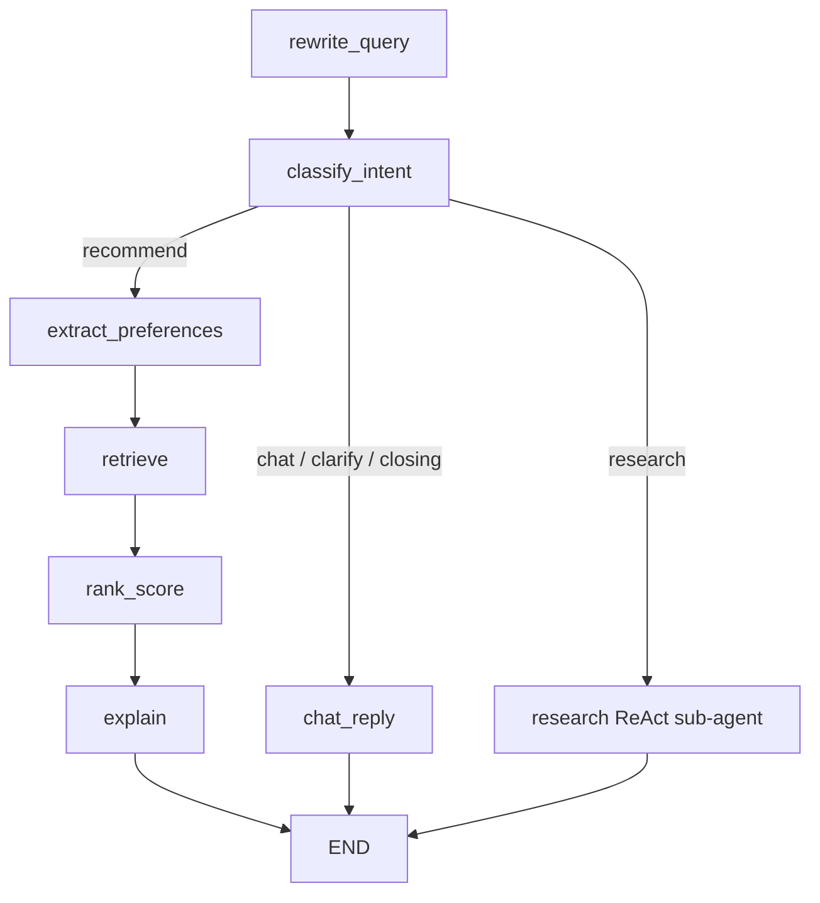

# Movie CRS — Demo Script & Deep-Dive

> A talking guide for demoing a **dual-pipeline conversational movie recommender** built on LangGraph, ChromaDB, and FastAPI, with a Streamlit chat UI and a live reasoning timeline.

---

## Table of Contents

1. [30-Second Pitch](#1-30-second-pitch)
2. [What You Will Show on Screen](#2-what-you-will-show-on-screen)
3. [Stack at a Glance](#3-stack-at-a-glance)
4. [Data Story — From Raw ReDial to Grounded Catalog](#4-data-story--from-raw-redial-to-grounded-catalog)
5. [Architecture Walkthrough](#5-architecture-walkthrough)
6. [Code Tour — Files to Open During the Demo](#6-code-tour--files-to-open-during-the-demo)
7. [Live Demo Script (Turn-by-Turn)](#7-live-demo-script-turn-by-turn)
8. [Challenges & How We Solved Them](#8-challenges--how-we-solved-them)
9. [Q&A — Flow & Implementation](#9-qa--flow--implementation)
10. [Q&A — Open-ended Design Decisions (“Why X, not Y?”)](#10-qa--open-ended-design-decisions-why-x-not-y)
11. [What’s Next](#11-whats-next)

---

## 1. 30-Second Pitch

> **The problem:** Classic collaborative-filtering recommenders match on IDs, not intent. A user who says *“something mind-bending like Nolan, but not too heavy”* gets pattern-matched to recent clicks, not to that actual sentence.
>
> **Our solution:** A conversational recommender that **routes each turn** — chit-chat, factual/fresh questions, and narrative recommendation requests take different paths through a **LangGraph state machine**. Recommendations are grounded in a 9,687-movie catalog enriched from TMDB and indexed in ChromaDB; research questions are answered by a ReAct sub-agent with IMDb + web tools.
>
> **What the demo shows:** Streaming tokens, an **expandable reasoning timeline** that exposes every step’s input/output, and the same graph driving both the sync and streaming endpoints.

---

## 2. What You Will Show on Screen

| Order | Surface | Purpose |
|------:|---------|---------|
| 1 | Streamlit UI at `localhost:8501` | The end-user view — chat + cards + reasoning sidebar. |
| 2 | `docs/graph_outer.png` | The actual compiled LangGraph with the ReAct sub-agent expanded via `xray=True`. |
| 3 | `models/agent/graph.py` | Two-screenful file — proves the graph is *code, not prose*. |
| 4 | `models/agent/nodes.py` | One closure per node — cleanly shows what each step *does*. |
| 5 | `utils/vector_store.py` | Retrieval + over-fetch + post-filter logic. |
| 6 | Reasoning sidebar (click a step) | Shows inputs/outputs as JSON — observability, not vibes. |

---

## 3. Stack at a Glance

```
┌────────────────────┐   HTTP stream   ┌─────────────────────────────────┐
│  Streamlit UI      │◄────────────────│  FastAPI (movie-crs-api:8000)   │
│  app_streamlit.py  │                 │   /recommend      (sync)        │
│  - chat bubbles    │                 │   /recommend/stream (tokens)    │
│  - movie cards     │                 │                                 │
│  - reasoning log   │                 │  Dispatches to:                 │
└────────────────────┘                 │   ├── RAGRecommender            │
                                       │   └── AgentRecommender          │
                                       │        └── LangGraph compiled   │
                                       │             ├── rewrite_query   │
                                       │             ├── classify_intent │
                                       │             ├── extract_prefs   │
                                       │             ├── retrieve  ──► ChromaDB
                                       │             ├── rank_score      │
                                       │             ├── explain   ──► LLM (stream)
                                       │             ├── chat_reply ──► LLM (stream)
                                       │             └── research ──► ReAct sub-agent
                                       │                              ├── search_imdb
                                       │                              └── search_web
                                       └─────────────────────────────────┘
```

| Concern | Tool | Why |
|---|---|---|
| LLM orchestration | **LangGraph** (`StateGraph`) | Explicit state, deterministic routing, first-class streaming, free PNG viz. |
| Vector DB | **ChromaDB (persistent client)** | Zero-ops, local persistence, metadata filters, good-enough at 10k docs. |
| Embeddings | **OpenAI `text-embedding-3-large`** | 3,072-dim, one call per batch, no GPU needed in the container. |
| Reasoning LLMs | **`gpt-4o` (main)** + **`gpt-4o-mini` (utility)** | Split cost/latency: utility handles rewrite + intent at temp 0–0.1; main writes prose at temp 0.7. |
| Web search | **Tavily** | Clean JSON, built for agentic LLM loops. |
| Factual lookups | **Cinemagoer (IMDb)** | Free, catalog-sized, complements Tavily nicely. |
| UI | **Streamlit** | One file, fast iteration, good enough for a chat UI. |
| Packaging | **Docker Compose** (api + web) | Reproducible demo on any machine with Docker. |

---

## 4. Data Story — From Raw ReDial to Grounded Catalog

**What the raw LLM-ReDial dataset gave us:**
- `item_map.json` — 9,687 movie titles, many with retail noise: `"The Godfather [Blu-ray]"`, `"Outland VHS"`, `"Special Edition"`.
- `final_data.jsonl` — 3,131 user dialogue records with likes/dislikes per conversation.
- `Conversation.txt` — 10,089 transcripts, multi-turn.
- **Missing:** year, rating, director, cast, overview, keywords — i.e. everything an LLM needs to avoid hallucinating.

**What we did — `scripts/enrich_tmdb_catalog.py`:**
1. Regex-strip retail suffixes (`VHS`, `DVD`, `Blu-ray`, `Director's Cut`, …) before searching TMDB.
2. Pull `overview`, `cast[:5]`, `director`, `year`, `release_date`, `keywords`, `genres`.
3. Merge into `data/llm_redial/tmdb_enriched_movies.json`, keyed on the original ReDial IDs (7,212/9,687 enriched — a 74% hit rate).
4. At load time, `MovieDataLoader._merge_tmdb_metadata` folds TMDB fields over the raw record; `_build_people_index` builds a `known_directors` / `known_cast` set for filter extraction.

**What the embedded text looks like** (from `MovieVectorStore._create_movie_text`):
```
Title: Blade Runner | Year: 1982 | Genres: Science Fiction, Drama, Thriller |
Overview: A blade runner must pursue... | Keywords: dystopia, replicant,
cyberpunk, bounty hunter | Director: Ridley Scott | Cast: Harrison Ford,
Rutger Hauer, Sean Young, Edward James Olmos, Daryl Hannah
```
> That structure is why a query like *“cyberpunk bounty hunter in dystopian LA”* hits the right films instead of drifting to unrelated action movies.

---

## 5. Architecture Walkthrough

### 5.1 One graph, two endpoints

Both the sync `/recommend` and the streaming `/recommend/stream` drive the same compiled graph:

```python
# models/agent/recommender.py (abridged)
self.graph = create_agent_graph(self.nodes)

# sync
result = await self.graph.ainvoke(initial_state)

# streaming — reuses the SAME graph, different stream modes
async for mode, event in self.graph.astream(
    initial_state, stream_mode=["updates", "messages"]
):
    ...
```

No duplicated routing table; no “which path got out of sync”.

### 5.2 Node graph



### 5.3 Intent → path contract

| Intent | Path | Token cost | Why |
|---|---|---|---|
| `recommend` | rewrite → classify → prefs → retrieve → rank → explain | Full | The only branch that hits Chroma + reranks + builds a candidates block. |
| `research` | rewrite → classify → **ReAct loop (imdb + web)** | Variable (tool iterations) | Only branch that can touch live info; docstrings steer tool choice, prompt injects `today`. |
| `chat` / `clarify` / `closing` | rewrite → classify → chat_reply | Minimal | Skips retrieval entirely — no point burning embeddings on “thanks!”. |

### 5.4 Streaming model

Two parallel channels inside a single `astream`:

- **`updates`** — node-boundary events. We turn each into a reasoning-timeline entry with a structured `{input, output}` payload and drop a `\x1e` (REASON_PING) sentinel into the HTTP body.
- **`messages`** — LLM token chunks. We filter on `metadata["langgraph_node"] ∈ {explain, chat_reply, research}` so only *final-answer* tokens reach the user, never intent/rewrite tokens.

The Streamlit client counts sentinels to know when to refresh the sidebar, and passes the non-sentinel bytes straight into the chat bubble.

### 5.5 Observability — the expandable reasoning log

- `utils/reasoning.py` writes **JSON Lines** (`ts`, `step`, `detail`, `data: {input, output}`).
- `models/agent/recommender.py::_summarize_node_update` serialises the per-node payload — rewritten query, intent label, filters, top-10 candidate titles, reranked scores, response previews.
- `app_streamlit.py::render_reasoning_entry` renders each entry as a native HTML `<details><summary>` so the user **clicks to unhide** the JSON — no Streamlit widget state needed.

---

## 6. Code Tour — Files to Open During the Demo

| # | File | What to say |
|---|------|-------------|
| 1 | [models/agent/graph.py](models/agent/graph.py) | “Here’s the graph, as code. Entry point, conditional edge, terminal edges — that’s it.” |
| 2 | [models/agent/nodes.py](models/agent/nodes.py) | “Each node is a closure over shared deps. One returns `{rewritten_query}`, another returns `{ranked}`, etc. LangGraph merges into state.” |
| 3 | [models/agent/recommender.py](models/agent/recommender.py) | “One graph, two public methods: `generate_recommendation` (`ainvoke`) and `stream_recommendation` (`astream`).” |
| 4 | [utils/vector_store.py](utils/vector_store.py#L185) | “Over-fetch `top_k * 4`, post-filter in Python, fall back to unfiltered if filters eliminate everything.” |
| 5 | [models/rag/filters.py](models/rag/filters.py) | “Pure regex + known-name lookup. No LLM call for filter extraction — keeps this fast + deterministic.” |
| 6 | [models/agent/tools.py](models/agent/tools.py) | “Two `@tool`-decorated functions. Docstrings are the primary routing signal — prompt is secondary.” |
| 7 | [prompts/templates.py](prompts/templates.py#L76) | “Research prompt injects `{today}` per-invocation. That’s how the agent stops thinking it’s 2023.” |
| 8 | [app_streamlit.py](app_streamlit.py#L137) | “JSON-line reader, HTML `<details>` renderer — no widget state hacks.” |

---

## 7. Live Demo Script (Turn-by-Turn)

Keep one terminal open: `docker logs -f movie-crs-api`.

### Turn 1 — thematic RAG pick (known user)
> **You type:** *“I want a dark, cerebral sci-fi thriller from the 90s.”*
- Expect: intent = `recommend`, filters = `{"genre": "thriller", "year_range": (1990, 1999)}`.
- Expand **Retrieved candidates** in the sidebar → show the filtered list.
- Expand **Ranked candidates** → show rerank scores changed the order.
- Show **Generated response** preview contains `**Title**`-bolded picks.

### Turn 2 — follow-up with pronoun
> **You type:** *“Something lighter than that.”*
- Expect **Rewrote query** to expand “that” with the previous turn’s title.
- This proves the rewrite node isn’t cosmetic — retrieval would bomb without it.

### Turn 3 — research (time-sensitive)
> **You type:** *“Any new movies releasing next month?”*
- Expect intent = `research`. In the API logs watch `[Tool] Searching Web for: ...` — the query should contain the **correct target month** derived from today’s date.
- Expand the Generated response — should mention specific upcoming titles.

### Turn 4 — mixed tool use
> **You type:** *“What is the release date of Dune Part Three and who’s in it?”*
- Best case: LLM fires **both** `search_web` (release date) and `search_imdb` (cast). Check logs for both.

### Turn 5 — chit-chat short-circuit
> **You type:** *“Thanks, that’s enough for tonight.”*
- Intent = `closing`, path = `chat_reply`. No Chroma call. Sidebar shows zero retrieval steps.

---

## 8. Challenges & How We Solved Them

> Be ready to talk about these as *engineering stories*, not bullet points.

### C1. Catalog sparsity made embeddings useless.
- **Problem:** ReDial gives titles only. Embedding `"Outland VHS"` gets you roughly nowhere.
- **Fix:** Built a TMDB enrichment pipeline. Regex-strip retail suffixes → search TMDB → merge structured fields → re-embed. 7,212/9,687 successfully enriched.
- **What we learned:** When the user asks *“gritty dystopian cyberpunk,”* the words `Keywords: dystopia, cyberpunk` in the embedded text do more work than any prompt tweak.

### C2. Follow-up queries broke retrieval.
- **Problem:** *“Something lighter than that”* embedded to nothing useful — the referent was in the previous turn.
- **Fix:** A tiny `gpt-4o-mini` call rewrites the utterance into a standalone query before retrieval. Only rewrites when genuinely ambiguous; leaves *“recommend a 90s noir”* alone.
- **Bonus:** Same rewriter is shared between RAG and Agent paths — one utility, two consumers.

### C3. The agent thought it was 2023.
- **Problem:** “Next month” in a research query would produce a Tavily query like *“movies releasing November 2023.”* Classic training-cutoff trap.
- **Fix:** Inject `today=date.today().isoformat()` into the research prompt at invocation time, and include an explicit rule: *“Use this to resolve phrases like ‘next month’ — do NOT rely on your training cutoff.”*

### C4. `astream_events(v2)` wouldn’t emit tokens from the ReAct sub-agent.
- **Problem:** Nested runnables created inside a node don’t always propagate `on_chat_model_stream` events to the outer graph.
- **Fix:** Switched to `graph.astream(stream_mode=["updates", "messages"])`. The `"messages"` mode yields token chunks with `metadata["langgraph_node"]`, which we filter to `{explain, chat_reply, research}`. Clean, and doesn’t depend on event plumbing internals.

### C5. Reasoning UI was a single line of text.
- **Problem:** *“Searched catalog”* tells the user nothing. They want to see what we actually searched for.
- **Fix:** Restructured the log as JSON Lines (`ts`, `step`, `detail`, `data`), built `_summarize_node_update` to capture the input/output of each node, and rendered entries as native `<details><summary>` so expansion is a browser feature — not a Streamlit state machine.

### C6. The research branch looked “web-only” in the PNG.
- **Problem:** `get_graph(xray=True).draw_mermaid_png()` sees `research_node` as an opaque function, so its ReAct internals stayed hidden.
- **Fix:** In `scripts/render_graph.py` only (viz-only, not runtime), register the compiled `create_react_agent(...)` *as* the `research` node. Now `xray=True` expands it — you see the `agent ⇄ tools` loop inside the outer graph.

### C7. Docker restarts didn’t pick up code.
- **Problem:** The Dockerfile `COPY`s code at build time. `docker compose restart` runs the existing image.
- **Fix:** Every iteration → `docker compose up -d --build movie-crs-api movie-crs-web`.

---

## 9. Q&A — Flow & Implementation

**Q: Walk me through a single recommend turn.**
1. `/recommend/stream` receives `{query, user_id, model_type: "agent"}`.
2. Per-user `history` is fetched from an in-process dict keyed on `user_id`.
3. `AgentRecommender.stream_recommendation` constructs an `AgentState` and calls `graph.astream(..., stream_mode=["updates","messages"])`.
4. `rewrite_query` → `classify_intent` → `extract_preferences` → `retrieve` (Chroma over-fetch + post-filter) → `rank_score` (keyword-overlap rerank) → `explain` (streaming LLM call).
5. For each `updates` event, we log a JSON line and emit a `\x1e` sentinel. For `messages` events from terminal nodes, we stream the raw tokens.
6. When the stream closes, FastAPI persists `{user_msg, assistant_msg}` to the session dict.

**Q: How does the classifier decide `research` vs `chat` vs `recommend`?**
An LLM call with an explicit priority rule: *“if the message mentions new / latest / upcoming / releasing / this month / currently / in theaters — pick `research`, even over `chat` or `recommend`.”* Low-temp (`0.1`) utility model for stability. Falls back to `recommend` on unknown labels.

**Q: Where does personalization come in?**
`build_user_profile_block` pulls the user’s recent likes / dislikes / rec_items from the ReDial record, injects them into the conversation-history block as a `USER PROFILE:` section, and also builds a `retrieval_boost` string that’s concatenated onto the embedding query. So likes shape *both* the prompt and the retrieval.

**Q: What does “over-fetch then filter” mean in practice?**
Chroma stores `genres`, `director`, `cast` as comma-joined strings in metadata — not arrays. Array-contains predicates aren’t reliable at the DB level. We ask Chroma for `fetch_k = top_k * 4` by vector similarity, then apply genre / year / director / actor filters in Python. If filtering wipes out all candidates, we fall back to the unfiltered top-K so the LLM always has something to reason over.

**Q: What does the reranker do?**
Pure keyword-overlap booster over the existing Chroma distance score. Lexical overlap → ratio → capped at `0.2` → added to `1/(1+distance)`. It fixes the common case where two neighbors differ only in whether the exact query terms show up in the overview. No cross-encoder, no extra latency.

**Q: How are tools bound to the ReAct agent?**
`create_react_agent(llm_main, tools=get_tools(), prompt=research_prompt)`. The *prompt* is a `SystemMessage` in natural language; the *tools* are passed as OpenAI function-calling schemas (name + docstring + param types). The LLM sees both. Docstrings are the primary routing signal; the prompt is secondary reinforcement. It can call zero, one, or both tools across multiple iterations.

**Q: Where does the streaming sentinel `\x1e` come from?**
ASCII 0x1E, Record Separator. Invisible to the user, impossible-to-produce by the LLM, cheap to grep on the client. We emit it after every node boundary; Streamlit counts them and repaints the sidebar without re-rendering the chat bubble.

**Q: What happens if the graph raises inside a node?**
`FastAPI → HTTP 500`, full traceback in `app.log`. The client receives a truncated stream; Streamlit catches the `requests` exception and shows `Streaming Error: ...`. No partial state is persisted because history is only written after the generator completes.

---

## 10. Q&A — Open-ended Design Decisions (“Why X, not Y?”)

**Q: Why `fetch_k = top_k * 4`?**
> I wanted enough headroom for the post-filter pass to still return `top_k` results in the common case. `2×` was too tight when the user specified both genre and year range — on a 10k catalog the intersection is narrow. `4×` empirically gave me ≥ top_k survivors on ~95% of filtered queries in ad-hoc testing. Going higher (`8×`, `16×`) inflates the vector query and the Python filtering loop for diminishing returns. If I had telemetry, I’d make this adaptive — shrink when no filters are active, grow only when the filter set gets specific.

**Q: Why two LLMs (`gpt-4o` + `gpt-4o-mini`)?**
> Rewrite and intent classification are **deterministic short tasks** — they want low temperature, low token budget, low latency. Explanation is a **creative long task** — it wants higher temperature, more tokens, and streaming. Splitting saves roughly an order of magnitude on utility-call cost without hurting recommendation quality.

**Q: Why LangGraph and not a hand-rolled state machine?**
> Three things I didn’t want to rebuild: (1) the same graph driving both `ainvoke` and `astream` with token-level granularity, (2) conditional edges that type-check against a `TypedDict` state, (3) a free PNG renderer with `xray` expansion of sub-agents. LangGraph is opinionated and has rough edges (see C4 about `astream_events`), but the alternative was writing my own streaming orchestrator, which is how small projects become big projects.

**Q: Why ChromaDB and not Pinecone / Qdrant / pgvector?**
> 10k documents, single-machine demo, zero ops. ChromaDB’s persistent client is a file on disk. Pinecone would add network latency and a cloud dependency for a catalog this small. pgvector would require pulling in Postgres. Qdrant is a reasonable alternative — I went with Chroma because LangChain’s integration and metadata filtering were already mature when I started. At 100M+ docs or multi-tenant, I’d reach for Qdrant or Pinecone.

**Q: Why a keyword reranker instead of a cross-encoder?**
> Two reasons. First, latency: a cross-encoder adds a per-candidate forward pass — at `fetch_k = 20` that’s 20 more inference calls. Second, this reranker is intentionally a *tiebreaker*, not a re-scorer: Chroma already did the heavy lifting via dense embeddings. Boosting by keyword overlap fixes the specific failure mode where the dense model ranks a near-miss above an exact-term match (e.g. *“cyberpunk”* actually appearing in the overview). It’s 5 lines of Python and runs in microseconds. If recall looked bad, I’d upgrade — but it doesn’t, so I won’t.

**Q: Why regex filter extraction instead of an LLM call?**
> Determinism, cost, latency. `"comedy from the 90s"` → `{"genre": "comedy", "year_range": (1990, 1999)}` every single time, zero tokens, zero network. The moment I wrap that in an LLM call, I inherit JSON parsing failures, model availability, and non-zero p99. For director/actor we *do* intersect against a curated `known_directors` / `known_cast` set built at load time — so *“movies with Denis Villeneuve”* still resolves correctly without an LLM.

**Q: Why a ReAct sub-agent only for the `research` intent?**
> Tools are expensive — each iteration is an LLM call + a tool call + another LLM call to reason about the result. Recommendation queries don’t need tools, they need good retrieval. Reserving the ReAct loop for queries that actually need *fresh* or *external* facts keeps p50 latency low for the common case. And because tools live in their own branch, I can swap them (add Trakt, Rotten Tomatoes, etc.) without touching the recommendation path.

**Q: Why write the reasoning log to a file and tail it from the UI, instead of pushing via WebSocket / SSE?**
> Two processes, one shared Docker volume, one flat file — and the browser doesn’t need a second connection. It’s the simplest thing that works. If the app scaled to many concurrent users, per-session files (or a Redis stream) would be obvious — but the design is intentionally single-user here, so a shared file is fine. Moving the reasoning payload to structured JSON Lines also made the UI expansion “free”: the browser renders `<details>`, I don’t need Streamlit widget state.

**Q: Why `temperature=0.1` on the utility model instead of `0`?**
> OpenAI occasionally errors on exactly `0.0` depending on model+endpoint. `0.1` is functionally deterministic for short classification + rewrite tasks, and it’s documented at the constructor — future me will wonder otherwise.

**Q: Why `history[-4:]` for rewrite context and `history[-6:]` for the main prompt?**
> Rewrite just needs to resolve pronouns, which rarely span more than one prior turn. Four messages = two full turns, which is enough without bloating the classifier input. The main prompt gets six so the LLM can mirror stylistic choices across a couple more turns — *“you mentioned you loved Interstellar earlier, so …”*.

**Q: Why route `clarify` and `closing` through `chat_reply` instead of giving each its own node?**
> They share a prompt shape: acknowledge + don’t recommend. The intent is passed into the prompt as a variable, and the LLM adapts its tone. Two extra nodes for two-line prompts is over-engineering; when the prompts diverge meaningfully, splitting is a 5-minute edit.

**Q: Why a simple in-process session dict for history?**
> For a single-machine demo, durability is not a requirement. For production I’d swap in Redis with a key TTL — it’s one function in `app.state.conversations` that needs replacing. The API shape (client sends `user_id`, server owns history) doesn’t change.

**Q: Why `text-embedding-3-large` (3,072 dims) instead of `3-small`?**
> 3-large’s retrieval quality is meaningfully better on narrative / thematic queries (the primary use case here), and we re-embed the catalog once, up front. The bigger index fits fine on disk at 10k docs. At 10M docs I’d reconsider — 3-small’s 1,536 dims halve index size and query cost.

---

## 11. What’s Next

- **Metric loop:** re-add an evaluation script over the held-out ReDial conversations to track recall@5 and explanation quality as we change prompts.
- **User-conditioned reranker:** fold the user’s liked/disliked titles into a learned reranker instead of only into the retrieval boost string.
- **Tool expansion:** add Trakt (watchlist), Rotten Tomatoes (critic score), OMDb (parental rating) behind the same ReAct loop — docstrings will do the routing.
- **Multi-user session store:** swap the in-process history dict for Redis with per-user TTL.
- **A/B-friendly prompts:** move the `explain` prompt into a versioned table so we can compare styles without redeploys.

---

### Appendix — One-liner Verification

```bash
docker compose -f docker-compose.yml up -d --build movie-crs-api movie-crs-web

# Thematic RAG
curl -s -X POST http://localhost:8000/recommend/stream \
  -H "Content-Type: application/json" \
  -d '{"query":"dark cerebral sci-fi thriller from the 90s","user_id":"demo","model_type":"rag"}' \
  | tr -d '\x1e'

# Research (should search for the right month, not "November 2023")
curl -s -X POST http://localhost:8000/recommend/stream \
  -H "Content-Type: application/json" \
  -d '{"query":"any new movies releasing next month","user_id":"demo","model_type":"agent"}' \
  | tr -d '\x1e'

# Tail reasoning log inside the container
docker exec movie-crs-api sh -c 'tail -f /app/logs/reasoning.log'
```
