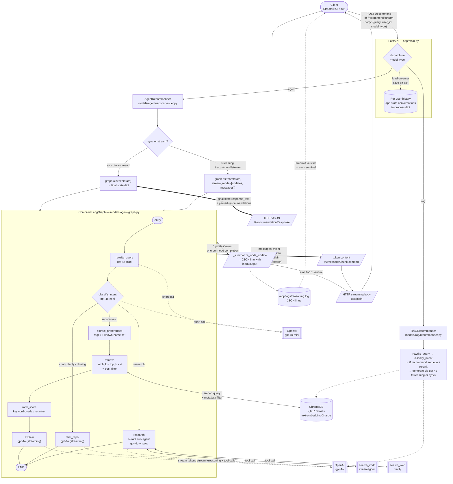

# Backend Flow — Query to Response

End-to-end architecture of a single request moving through the Movie CRS backend.

---

## Full Flow Diagram

---

## Legend — What Each Arrow Means

| Arrow style | Meaning |
|---|---|
| `-->` solid | Normal control flow — function A calls function B. |
| `-.->` dotted | Side-channel / observational — log writes, session reads, LLM calls. |
| `==>` thick | Streaming output — generator yields or event iteration. |
| `<-->` double | Request/response to an external system (ChromaDB, tools). |

| Node shape | Meaning |
|---|---|
| `([ ... ])` stadium | Entry / exit points (Client, Entry, END). |
| `[ ... ]` rectangle | Internal pipeline node or helper function. |
| `{ ... }` diamond | Decision point (router / conditional edge). |
| `[( ... )]` cylinder | Persistent store (ChromaDB, session dict, log file). |
| `[[ ... ]]` subroutine | External service (OpenAI, Tavily, IMDb). |
| `[/ ... /]` parallelogram | Data-in-flight (streaming chunks, JSON payloads). |

---

## The Flow in Plain English

1. **Client → FastAPI.** Browser or curl hits `/recommend` (sync) or `/recommend/stream` (streaming). Body is `{query, user_id, model_type}`.
2. **Session load.** FastAPI pulls the user's history out of `app.state.conversations` (in-process dict keyed on `user_id`).
3. **Route on `model_type`.** `rag` → `RAGRecommender`; `agent` → `AgentRecommender`.
4. **Agent path runs the compiled LangGraph.**
   - **Sync** uses `graph.ainvoke(state)` and collects the final state.
   - **Streaming** uses `graph.astream(state, stream_mode=["updates", "messages"])`.
5. **Inside the graph:**
   1. `rewrite_query` expands pronouns using recent turns (utility LLM).
   2. `classify_intent` produces one of `{recommend, chat, clarify, closing, research}`.
   3. **Conditional edge** branches:
      - `recommend` → preferences → retrieve → rank_score → explain.
      - `chat / clarify / closing` → chat_reply (no retrieval).
      - `research` → ReAct sub-agent with `search_imdb` + `search_web`.
6. **External calls** happen inside nodes: Chroma for retrieval, Tavily/IMDb for tools, OpenAI for all LLM calls.
7. **Streaming emits two interleaved channels:**
   - `"updates"` — per-node completion events → `_summarize_node_update` flattens them to JSON lines written to `/app/logs/reasoning.log`; a `0x1E` sentinel byte is yielded over HTTP so the UI knows to re-read the log.
   - `"messages"` — per-token LLM chunks, filtered to terminal nodes `{explain, chat_reply, research}` → yielded as raw text chunks into the HTTP body.
8. **Client receives:**
   - Sync path: a single JSON `RecommendationResponse` with `response_text`, parsed recommendations, and timing.
   - Streaming path: a live text stream (tokens + sentinels). Streamlit appends tokens to the chat bubble and, on each sentinel, refreshes the expandable reasoning sidebar by re-reading the log file.
9. **Session save.** When the stream closes, FastAPI persists the `{user, assistant}` message pair back into `app.state.conversations` for the next turn.

---

## Where to Find Each Box in the Code

| Diagram box | Source |
|---|---|
| FastAPI endpoints | [app/main.py](../app/main.py) |
| `AgentRecommender` | [models/agent/recommender.py](../models/agent/recommender.py) |
| Graph definition | [models/agent/graph.py](../models/agent/graph.py) |
| Node implementations | [models/agent/nodes.py](../models/agent/nodes.py) |
| Retrieve + filter logic | [utils/vector_store.py](../utils/vector_store.py#L185) |
| Reranker | [utils/reranker.py](../utils/reranker.py) |
| Intent classifier | [models/agent/intent.py](../models/agent/intent.py) |
| Query rewriter | [models/query_rewrite.py](../models/query_rewrite.py) |
| Filter extraction | [models/rag/filters.py](../models/rag/filters.py) |
| Tools (IMDb + Tavily) | [models/agent/tools.py](../models/agent/tools.py) |
| Prompts | [prompts/templates.py](../prompts/templates.py) |
| Reasoning log writer | [utils/reasoning.py](../utils/reasoning.py) |
| Reasoning log reader (UI) | [app_streamlit.py](../app_streamlit.py) |
