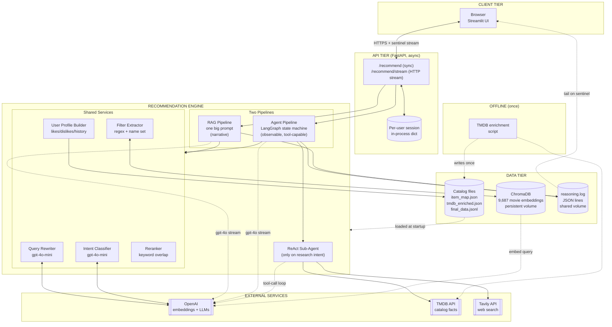

# System Design — Simple View

A one-page architecture suitable for a whiteboard or interview overview slide.

---

## Layered View



---

## Five-Tier Cheat Sheet

| Tier | Component | Role | Why |
|---|---|---|---|
| 1. Client | Streamlit UI | Chat input + reasoning sidebar + movie cards | Single-file, fast iteration |
| 2. API | FastAPI (async) | Sync + streaming endpoints, per-user session | Async = high concurrency per worker |
| 3. Engine | RAG pipeline | Narrative recommendation, one LLM call | Lower orchestration cost |
| 3. Engine | Agent pipeline | Observable graph, branches to tools for research | Per-node debuggability + extensibility |
| 3. Engine | Shared services | Rewrite, classify, filter, rerank, profile | One investment benefits both pipelines |
| 3. Engine | ReAct sub-agent | Tool-using loop, only on research intent | Tools are expensive — gated by intent |
| 4. Data | ChromaDB | 9,687 movie embeddings, persistent volume | Zero-ops at this scale |
| 4. Data | Catalog files | item_map + TMDB-enriched + ReDial dialogues | Loaded once at startup, in-memory after |
| 4. Data | reasoning.log | JSON lines, shared Docker volume | Doorbell pattern — UI re-reads on sentinel |
| 5. External | OpenAI | Embeddings + utility LLM + main LLM | Two model tiers: ~10× cost split |
| 5. External | TMDB | Catalog enrichment + runtime fact lookup | Real API, parallelizable, generous free tier |
| 5. External | Tavily | Live web search for time-sensitive queries | Built for agentic loops |
| Offline | TMDB enrichment | One-time script, writes catalog file | Keeps third-party calls off the hot path |

---

## Request Lifecycle in Five Steps

```
1. Browser                    →  POST /recommend/stream
2. FastAPI                    →  load session, dispatch to RAG or Agent
3. Engine                     →  rewrite → classify → (filter + retrieve + rerank)
                                  → generate (single LLM for RAG; graph node for Agent)
4. Streaming response         →  text tokens + sentinel bytes flow back
5. Browser                    →  appends tokens to chat bubble,
                                  re-reads reasoning.log on each sentinel
```

---

## Production-Scale Migration Path

```
TODAY                          ─────►   AT 1M+ USERS
─────                                   ────────────
ChromaDB (single instance)              Qdrant / Pinecone (replicas)
In-process session dict                 Redis cluster (TTL keys)
Single FastAPI process                  Kubernetes + HPA
Single OpenAI key                       Multi-key + Bedrock/Azure
File-based reasoning log                Per-session Redis stream
No caching                              Prompt cache + result cache (5min)
No metrics                              Prometheus + Grafana
No rate limiting                        Redis token bucket per user
```

The API is **already stateless** aside from the session dict — every other migration is a one-component swap.

---

## What's Async vs Sync

| Path | Async? | Reason |
|---|---|---|
| FastAPI request handling | Async | High concurrency per worker |
| OpenAI calls | Async (`AsyncOpenAI`) | Don't block event loop |
| Chroma calls | Sync, offloaded via `loop.run_in_executor` | Keeps event loop free |
| TMDB calls | Sync httpx (pooled) | Inside thread pool already |
| Tavily | Sync (LangChain wrapper) | Same |
| File I/O for reasoning.log | Sync (small writes) | Negligible cost |

One Python worker handles hundreds of concurrent requests because CPU mostly waits on I/O.
